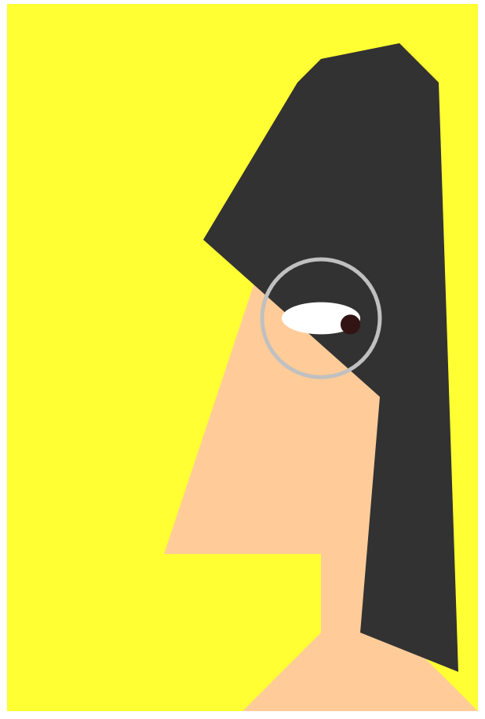

## Art Jam: Self-Portrait

Joyce Angelina Lam

[View my project online](https://ajoycel.github.io/cart253-2025/art-jam/)

## Description
This project is a stylised self-portrait, whose pupil motion is called by mouseX and mouseY.

## Contribution(s)
- The use of vertex() to draw the portrait.
- The use of map() to limit pupil mition range.

## Screenshot(s)

## Attribution
- This project uses [p5.js]( https://p5js.org/reference/p5/vertex/)
- A lot of this code is taken and inspired by Pippin Barr

