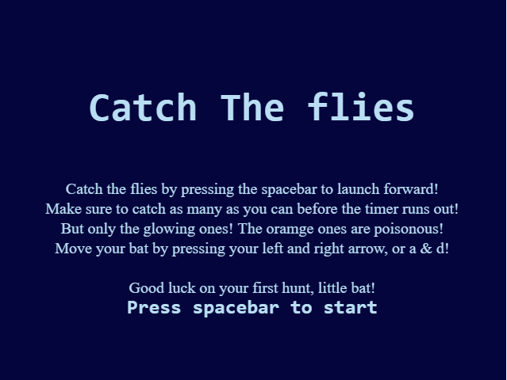
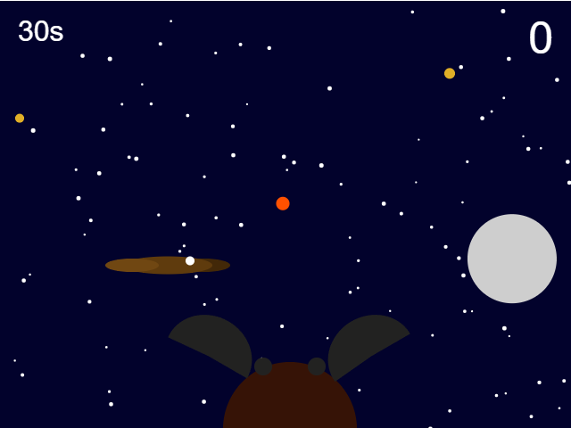
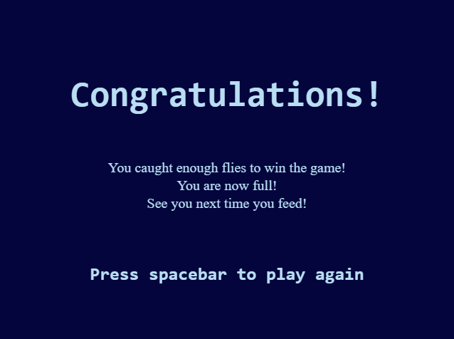
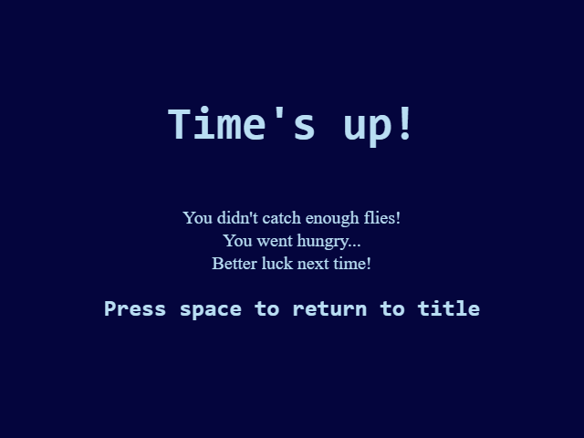

# Mod Jam

Joyce Angelina Joyce

[View my project online](https://ajoycel.github.io/cart253-2025/mod_jam/)

## Description
You play as a bat on a night hunt.
- Intructions   
    - Move the player with A/D keys or Left/Right arrows.
    - Spacebar to launch bat.
    - Overlap yellow flies = +points, overlap orange butterfly = _points.
    - Reach 10 points to win.

## Contribution(s)
> - Visual/Audio
    - I added different audios to the title, game, win and lose(game over) screen.
    - I added a monarch butterfly(orange circle) as an enemy.
    - I added a superfly that gives twice the point of a fly.
    - I changed the frog to a bat (rather than launchign a tongue, the bat springs forward to catch the flies).
    - changed the background from morning to night with stars(taken from the starfield project).
    - I added a moon that moves across the sky in an arc.
    - Made the sky transition smoothly from night to day and the star vanish.

> - Gameplay
    - The bat moves by pressing down on the left and right arrow or the A and D key.
    - Spacebar is used to start the game as well as launching the tongue.
    - I added a paddle(bird) that blocks the bat and forces it backwards when hit/overlap.

> - Movement
    - The fly, superfly and butterfly move on a sine and cosine line respectively => reference from p5 : https://p5js.org/examples/angles-and-motion-sine-cosine/
    - The paddle moves randomly(I took the code from the Frogfrogfrog project fly movement).

> - State
    - There is a title screen => a game screen => a win and lose screen.

## Screenshot(s)

## Attribution

- This project uses [p5.js](https://p5js.org).
- A lot of this code is taken and inspired by Pippin Barr
- The Timer taken from codePal.
- The Audion from [freesound.org](https://freesound.org/people/crazymonke9/sounds/418107/)

## License

This bit should include the license you want to apply to your work. For example:

> This project is licensed under a Creative Commons Attribution ([CC BY 4.0](https://creativecommons.org/licenses/by/4.0/deed.en)) license with the exception of libraries and other components with their own licenses.