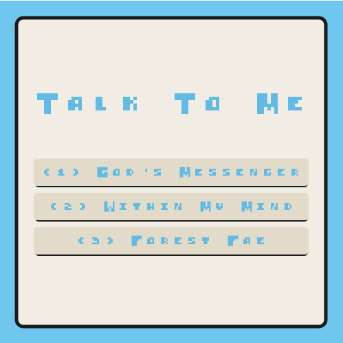
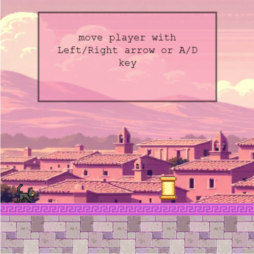
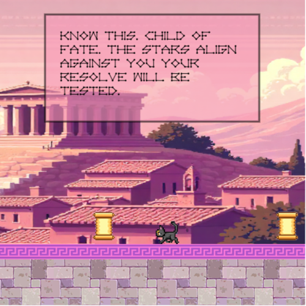
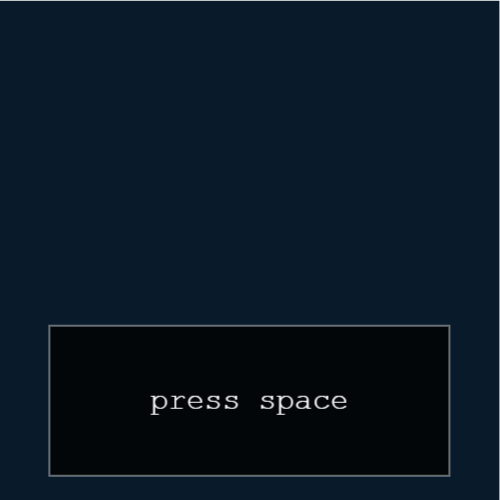
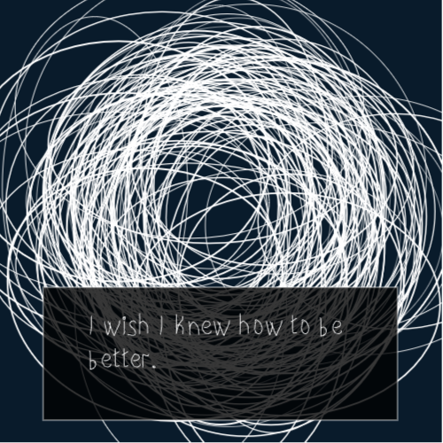
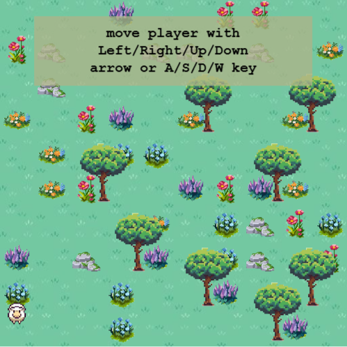
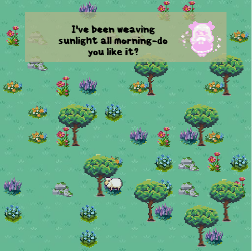
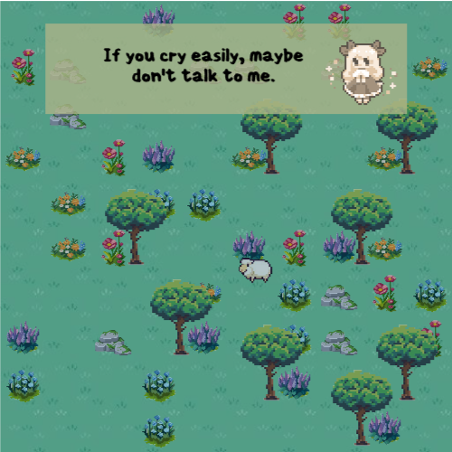
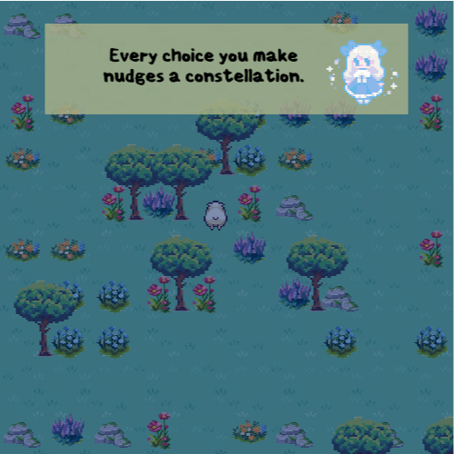

# Talk To Me

Joyce Angelina Lam

[View the game](https://ajoycel.github.io/cart253-2025/variations_jam)

## Description
Talk To Me is a dialogue-based game where you (the player) move and interact with onjects to trigger speech. There will be different speech variations to each game.

- There are three variations to this game: 
    1. In God's Messenger, you(the player) are a messenger, answering the call of your Goddess and delivering her prophecies to the people who worship her at the state temple.
        Instruction:
        - Move the player with left/right arrow and/or A/D key.
        - Overlap with scrolls to call the messeges. 

    2. In Within My Mind, you(the player) are a very self-conscious person who often doubts themselves. You often doubt yourself, your ideas and/or your acts in your consciousness.
        Instruction: 
        - Press spacebar to trigger self-doubt.

    3. In Forest Fae, you(the player) are a lost sheep, encountering mischevious little creatures while trotting through their forest.
        Instruction: 
        - Move the player with left/right/up/down arrows and/or A/S/D/W key.
        - Overlap with the flowers, pebbles and trees to call the fairies.

  
## Screenshot(s)

1. God's Messenger

2. Within My Mind

3. Forest Fae

## Attribution

- This project uses [p5.js](https://p5js.org).
- A lot of the code was taken and inspired by Pippin Barr.
- The red variaiton background is from Freepik: https://www.freepik.com
- The red variation pavement and stone are from Pinterest.
- The fonts are from itch.io: [Novem](https://ggbot.itch.io/novem-font) / [First time writing](https://ggbot.itch.io/first-time-writing-font) / [CHUNKY](https://batfeula.itch.io/chunky) / [scabber](https://ggbot.itch.io/scabber-font)
- The speech variation are created by Chat GPT.
- Grid layout taken from https://youtu.be/UKxB2j4h7Ag?si=EbnC4iFkfhC2JVOF

## License

This bit should include the license you want to apply to your work. For example:

> This project is licensed under a Creative Commons Attribution ([CC BY 4.0](https://creativecommons.org/licenses/by/4.0/deed.en)) license with the exception of libraries and other components with their own licenses.
